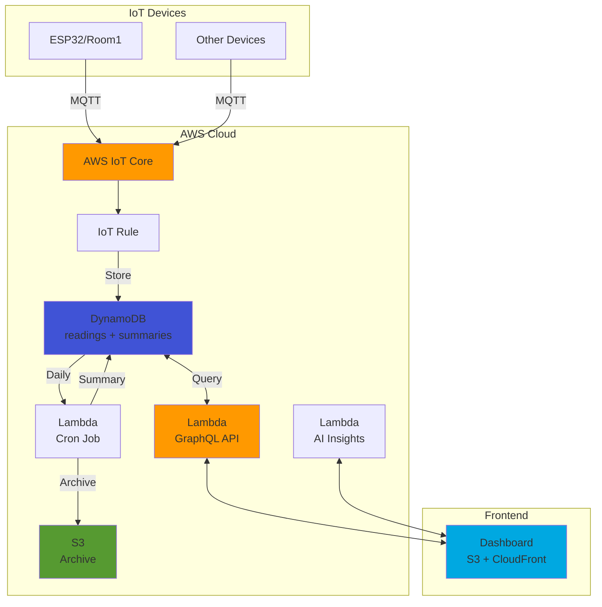

# 🏠 Smart Home Energy Monitor

> Real-time IoT energy monitoring system with AI-powered insights and automated reporting

[](https://opensource.org/licenses/MIT)
[](https://nodejs.org/)
[](https://aws.amazon.com/)
[](https://www.serverless.com/)

<p align="center">
  
</p>

---

## 📋 Table of Contents

- [Overview](#-overview)
- [Features](#-features)
- [Architecture](#-architecture)
- [Quick Start](#-quick-start)
- [Installation](#-installation)
- [Configuration](#-configuration)
- [Usage](#-usage)
- [API Documentation](#-api-documentation)
- [Testing](#-testing)
- [Deployment](#-deployment)
- [Project Structure](#-project-structure)
- [Troubleshooting](#-troubleshooting)
- [Contributing](#-contributing)
- [License](#-license)

---

## 🎯 Overview

**Smart Home Energy Monitor** เป็นระบบ IoT แบบ Real-time สำหรับติดตามการใช้พลังงานไฟฟ้าในบ้านและสำนักงาน รองรับหลายอุปกรณ์พร้อมกัน พร้อม AI Insights จาก Google Gemini API เพื่อช่วยประหยัดค่าไฟ

### 🌟 Key Highlights

- ⚡ **Real-time Monitoring** - อัปเดตข้อมูลทุก 30 วินาที
- 📊 **Historical Analysis** - เก็บข้อมูลย้อนหลัง 30 วัน (summary ถึง 1 ปี)
- 🤖 **AI-Powered Insights** - คำแนะนำประหยัดพลังงานจาก Google Gemini
- 🌓 **Day/Night Tariff** - คำนวณค่าไฟตามอัตราก้าวหน้า
- 📱 **Responsive Dashboard** - ใช้งานได้ทั้ง Desktop และ Mobile
- 💰 **Cost-Effective** - ค่าใช้จ่าย AWS < $1/เดือน
- 🔄 **Automated Archiving** - สำรองข้อมูลอัตโนมัติทุกวัน

### 🎓 Project Context

โปรเจกต์นี้พัฒนาเพื่อ:
- แก้ปัญหาการใช้ไฟฟ้าสิ้นเปลืองในบ้าน
- ศึกษาการใช้งาน AWS Serverless Architecture
- ประยุกต์ใช้ IoT, Cloud Computing และ AI

---

## ✨ Features

### 📊 Dashboard
- แสดงการใช้ไฟฟ้า Real-time (Current, Peak, Standby)
- กราฟ Standby vs Active Power (Donut Chart)
- สถิติการใช้งาน 30 วันย้อนหลัง (Bar Chart)
- รองรับหลายอุปกรณ์ (Multi-device support)
- ปุ่มสลับ Today/Yesterday

### 📈 Reports
- สร้างรายงานตามช่วงวันที่ที่กำหนด
- คำนวณค่าไฟโดยประมาณ (ตามอัตราก้าวหน้า)
- แยก Day/Night tariff ชัดเจน
- ดาวน์โหลดเป็น CSV สำหรับวิเคราะห์เพิ่มเติม

### 🤖 AI Insights
- วิเคราะห์พฤติกรรมการใช้ไฟ
- ให้คำแนะนำประหยัดพลังงาน
- รองรับภาษาไทย
- ใช้ Google Gemini 2.5 Flash

### 🔧 Backend
- **GraphQL API** - ยืดหยุ่น query ได้ตามต้องการ
- **Cron Job** - Archive ข้อมูลอัตโนมัติทุกวันเวลา 02:00 น.
- **TTL-based Retention** - ลบข้อมูลเก่าอัตโนมัติ (30 วัน/1 ปี)
- **Gzip Compression** - ประหยัด storage cost

---

## 🏗️ Architecture



### Data Flow

1. **IoT Device** ส่งข้อมูลทุก 30 วินาที → AWS IoT Core (MQTT)
2. **IoT Rule** ตรวจจับข้อมูล → เก็บลง DynamoDB
3. **DynamoDB** เก็บ readings ชั่วคราว (TTL 30 วัน)
4. **Lambda Cron** ทำงานทุกวันตี 2:
   - คำนวณ kWh (day/night)
   - สร้าง daily summary
   - Archive ไป S3 (gzip)
5. **Dashboard** query ข้อมูลผ่าน GraphQL API
6. **AI Insights** วิเคราะห์ข้อมูลผ่าน Gemini API

---

## 🚀 Quick Start

### Prerequisites

- **Node.js** >= 18.0.0
- **AWS Account** ([สมัครฟรี](https://aws.amazon.com/free/))
- **AWS CLI** configured
- **Serverless Framework** >= 3.0.0
- **ESP32** หรืออุปกรณ์ IoT ที่รองรับ MQTT

### Installation (5 นาที)

```bash
# 1. Clone repository
git clone https://github.com/yourusername/smart-home-energy-monitor.git
cd smart-home-energy-monitor

# 2. Install dependencies
npm install

# 3. Configure AWS credentials
aws configure --profile serverless-personal

# 4. Create environment file
cp .env.example .env
# แก้ไข .env ใส่ GEMINI_API_KEY

# 5. Deploy to AWS
serverless deploy

# 6. Deploy dashboard
serverless client deploy
```

### ทดสอบว่าใช้งานได้

```bash
# ทดสอบ GraphQL API
curl -X POST https://YOUR_API_ID.execute-api.ap-southeast-2.amazonaws.com/prod/graphql \
  -H "Content-Type: application/json" \
  -d '{"query":"{ listDevices }"}'

# ควรได้ผลลัพธ์:
# {"data":{"listDevices":["ESP32","Room1"]}}
```

### เปิด Dashboard

```
https://smart-home-energy-monitor-www.s3-website-ap-southeast-2.amazonaws.com
```

---

## 📦 Installation

### Step 1: Clone Repository

```bash
git clone https://github.com/yourusername/smart-home-energy-monitor.git
cd smart-home-energy-monitor
```

### Step 2: Install Dependencies

```bash
npm install
```

### Step 3: Configure AWS Credentials

```bash
aws configure --profile serverless-personal
# AWS Access Key ID: [ใส่ key ของคุณ]
# AWS Secret Access Key: [ใส่ secret ของคุณ]
# Default region name: ap-southeast-2
# Default output format: json
```

### Step 4: Set Environment Variables

สร้างไฟล์ `.env`:

```bash
cp .env.example .env
```

แก้ไข `.env`:

```bash
# Google Gemini API Key (สมัครที่ https://ai.google.dev/)
GEMINI_API_KEY=your_gemini_api_key_here

# Optional: ปรับแต่ง
AWS_REGION=ap-southeast-2
```

---

## ⚙️ Configuration

### IoT Device Setup

#### 1. สร้าง Thing ใน AWS IoT Core

```bash
# ใช้ AWS Console หรือ CLI
aws iot create-thing --thing-name Room1 --region ap-southeast-2
```

#### 2. Download Certificates

- CA Certificate
- Device Certificate (.pem.crt)
- Private Key (.pem.key)

#### 3. Flash Firmware

อัปเดต firmware ของ ESP32:

```cpp
// config.h
const char* THING_NAME = "Room1";
const char* MQTT_TOPIC = "esp32/data";
const char* AWS_IOT_ENDPOINT = "xxxxx.iot.ap-southeast-2.amazonaws.com";
```

#### 4. Attach Policy

```bash
aws iot attach-policy \
  --policy-name smart-home-energy-monitor-iotPolicyForDevices-XXX \
  --target arn:aws:iot:ap-southeast-2:ACCOUNT_ID:cert/CERT_ID
```

### Serverless Configuration

แก้ไข `serverless.yml` (ถ้าต้องการ):

```yaml
provider:
  region: ap-southeast-2  # เปลี่ยน region
  stage: prod             # หรือ dev, staging
  
functions:
  dailyDataArchive:
    events:
      - schedule:
          rate: cron(0 19 * * ? *)  # UTC time (02:00 ICT)
```

---

## 📖 Usage

### Deploy Backend

```bash
# Deploy ทั้งหมด
serverless deploy

# Deploy เฉพาะ function
serverless deploy function -f graphql
serverless deploy function -f dailyDataArchive

# Deploy ไปยัง stage อื่น
serverless deploy --stage dev
```

### Deploy Dashboard

```bash
serverless client deploy
```

### View Logs

```bash
# Real-time logs
serverless logs -f graphql --tail

# Logs ย้อนหลัง 1 ชั่วโมง
serverless logs -f dailyDataArchive --startTime 1h

# CloudWatch Logs (AWS Console)
```

### Test Functions Locally

```bash
# Test GraphQL
serverless invoke local -f graphql \
  --data '{"body":"{\"query\":\"{ listDevices }\"}"}'

# Test Cron Job
serverless invoke -f dailyDataArchive --log
```

### Remove Stack

```bash
# ⚠️ ลบทุกอย่าง (ระวัง!)
serverless remove
```

---

## 🔌 API Documentation

### GraphQL Endpoint

```
POST https://YOUR_API_ID.execute-api.ap-southeast-2.amazonaws.com/prod/graphql
Content-Type: application/json
```

### Available Queries

#### 1. List Devices

```graphql
query {
  listDevices
}
```

**Response:**
```json
{
  "data": {
    "listDevices": ["ESP32", "Room1", "Kitchen"]
  }
}
```

#### 2. Get Real-time Data

```graphql
query {
  realtime(deviceId: "Room1", sinceTimestamp: 1760000000) {
    timestamp
    reading
  }
}
```

**Response:**
```json
{
  "data": {
    "realtime": [
      { "timestamp": 1760120344, "reading": 523 },
      { "timestamp": 1760120374, "reading": 587 }
    ]
  }
}
```

#### 3. Get Historical Readings

```graphql
query {
  readings(
    deviceId: "Room1"
    startDate: 1760115600
    endDate: 1760202000
  ) {
    timestamp
    reading
  }
}
```

#### 4. Get Statistics

```graphql
query {
  stats(deviceId: "Room1") {
    always_on
    today_so_far
  }
}
```

**Response:**
```json
{
  "data": {
    "stats": {
      "always_on": 45,      // Standby power (Watts)
      "today_so_far": 2.456 // kWh today
    }
  }
}
```

#### 5. Get Daily Usage Summary

```graphql
query {
  usageData(
    deviceId: "Room1"
    startDate: 1759511200
    endDate: 1760202000
  ) {
    timestamp
    dayUse
    nightUse
  }
}
```

**Response:**
```json
{
  "data": {
    "usageData": [
      {
        "timestamp": 1760115600,
        "dayUse": 2.456,
        "nightUse": 1.234
      }
    ]
  }
}
```

### AI Insights API

```bash
curl -X POST https://YOUR_API_ID.execute-api.ap-southeast-2.amazonaws.com/prod/get-insights \
  -H "Content-Type: application/json" \
  -d '{
    "prompt": "ฉันใช้ไฟ 2.5 kWh วันนี้ แนะนำวิธีประหยัดหน่อย"
  }'
```

**Response:**
```json
{
  "candidates": [{
    "content": {
      "parts": [{
        "text": "จากการใช้ไฟ 2.5 kWh ในวันนี้..."
      }]
    }
  }]
}
```

---

## 🧪 Testing

### Run Unit Tests

```bash
# Run all tests
npm test

# Run specific test
npm test -- CalculateKwh.test.js

# Watch mode
npm test -- --watch
```

### Test Coverage

```bash
npm run test:coverage
```

**Current Coverage:**
- `CalculateKwh.js` - 100%
- `IsNightTarif.js` - 100%

### Manual Testing

```bash
# Test GraphQL API
curl -X POST https://YOUR_API/graphql \
  -H "Content-Type: application/json" \
  -d '{"query":"{ listDevices }"}'

# Test specific device
curl -X POST https://YOUR_API/graphql \
  -H "Content-Type: application/json" \
  -d '{"query":"{ stats(deviceId:\"Room1\") { always_on today_so_far } }"}'
```

---

## 🚢 Deployment

### Production Deployment

```bash
# 1. Run tests
npm test

# 2. Run linter
npm run lint

# 3. Deploy to production
serverless deploy --stage prod

# 4. Deploy dashboard
serverless client deploy

# 5. Verify deployment
curl https://YOUR_API/graphql \
  -d '{"query":"{ listDevices }"}'
```

### Rollback

```bash
# List deployments
serverless deploy list

# Rollback to previous
serverless rollback --timestamp TIMESTAMP
```

### CI/CD (Optional)

ใช้ GitHub Actions:

```yaml
# .github/workflows/deploy.yml
name: Deploy to AWS
on:
  push:
    branches: [main]
jobs:
  deploy:
    runs-on: ubuntu-latest
    steps:
      - uses: actions/checkout@v2
      - uses: actions/setup-node@v2
      - run: npm install
      - run: npm test
      - run: serverless deploy
```

---

## 📁 Project Structure

```
smart-home-energy-monitor/
├── core/                    # Core business logic
│   ├── aws-connections.js   # AWS SDK clients
│   ├── config.js            # Configuration
│   ├── errors.js            # Custom errors
│   ├── helpers.js           # Utilities
│   └── helpers/
│       ├── CalculateKwh.js
│       └── IsNightTarif.js
│
├── functions/               # AWS Lambda functions
│   ├── cron-rotate-daily.js
│   ├── getAiInsights.js
│   └── graphql/
│       ├── graphql.js
│       └── resolvers/
│
├── dashboard/               # Frontend
│   ├── index.html
│   ├── report.html
│   ├── main.js
│   └── report.js
│
├── docs/                    # Documentation
│   ├── CODE_STRUCTURE.md
│   ├── API.md
│   └── DEVELOPMENT.md
│
├── tests/                   # Unit tests
├── .env.example             # Environment template
├── .eslintrc.json           # ESLint config
├── .gitignore
├── package.json
├── serverless.yml
└── README.md
```

**อ่านเพิ่มเติม:** [CODE_STRUCTURE.md](docs/CODE_STRUCTURE.md)

---

## 🐛 Troubleshooting

### ปัญหา: ไม่มีข้อมูลแสดงใน Dashboard

**สาเหตุ:**
1. Device ไม่ได้ส่งข้อมูล
2. IoT Rule ไม่ทำงาน
3. Permission ผิดพลาด

**วิธีแก้:**

```bash
# 1. ตรวจสอบ DynamoDB
aws dynamodb scan --table-name smart-home-energy-monitor --limit 5

# 2. ตรวจสอบ IoT Core Logs
# ไปที่ AWS Console → IoT Core → Test → Subscribe topic: esp32/data

# 3. ตรวจสอบ Lambda Logs
serverless logs -f graphql --tail
```

### ปัญหา: AI Insights ไม่ทำงาน

**สาเหตุ:** API Key ไม่ถูกต้อง

**วิธีแก้:**

```bash
# ตรวจสอบ environment variable
serverless invoke -f getAiInsights \
  --data '{"body":"{\"prompt\":\"test\"}"}'

# ถ้า error ให้ update .env แล้ว deploy ใหม่
serverless deploy function -f getAiInsights
```

### ปัญหา: Cron Job ไม่ทำงาน

**สาเหตุ:** EventBridge Rule disabled

**วิธีแก้:**

```bash
# Manual invoke
serverless invoke -f dailyDataArchive --log

# ตรวจสอบ EventBridge
aws events list-rules --name-prefix smart-home
```

**เพิ่มเติม:** [Troubleshooting Guide](docs/TROUBLESHOOTING.md)

---

## 💰 Cost Estimation

การใช้งานปกติ (1-2 devices, moderate usage):

| Service | Usage | Monthly Cost |
|---------|-------|--------------|
| Lambda | ~100K invocations | **$0.20** (Free tier) |
| DynamoDB | 1 GB storage | **$0.25** |
| S3 | 5 GB storage | **$0.12** |
| IoT Core | 1M messages | **$0.08** |
| API Gateway | 100K requests | **$0.35** |
| **Total** | | **< $1.00/month** |

💡 **คำแนะนำประหยัดต้นทุน:**
- ใช้ DynamoDB On-Demand (pay-per-request)
- เปิด S3 Lifecycle policy (archive เก่าไป Glacier)
- ใช้ CloudFront Free Tier สำหรับ Dashboard

---

## 🤝 Contributing

ยินดีรับ Contributions! 🎉

### How to Contribute

1. Fork repository
2. Create feature branch (`git checkout -b feature/AmazingFeature`)
3. Commit changes (`git commit -m 'feat: Add AmazingFeature'`)
4. Push to branch (`git push origin feature/AmazingFeature`)
5. Open Pull Request

### Commit Convention

ใช้ [Conventional Commits](https://www.conventionalcommits.org/):

```
feat: เพิ่ม feature ใหม่
fix: แก้ bug
docs: แก้ไข documentation
style: จัดรูปแบบโค้ด
refactor: ปรับปรุงโค้ดโดยไม่เปลี่ยนพฤติกรรม
test: เพิ่มหรือแก้ไข tests
chore: งาน maintenance
```

### Code Style

```bash
# ตรวจสอบ code style
npm run lint

# แก้ไขอัตโนมัติ
npm run lint:fix
```

---

## 📄 License

This project is licensed under the **MIT License** - see the [LICENSE](LICENSE) file for details.

```
MIT License

Copyright (c) 2025 [Your Name]

Permission is hereby granted, free of charge, to any person obtaining a copy...
```

---

## 👥 Authors

**Your Name**
- GitHub: [@yourusername](https://github.com/yourusername)
- Email: apiwit806@gmail.com
- LinkedIn: [Your LinkedIn](https://linkedin.com/in/yourprofile)

---

## 🙏 Acknowledgments

- **AWS Serverless Framework** - Infrastructure as Code
- **Google Gemini API** - AI Insights
- **Dygraphs** - Time-series charting
- **Chart.js** - Statistical charts
- **Tailwind CSS** - UI styling
- **Community** - All contributors and supporters

---

## 📚 Additional Resources

### Documentation
- [API Documentation](docs/API.md)
- [Code Structure](docs/CODE_STRUCTURE.md)
- [Development Guide](docs/DEVELOPMENT.md)
- [Deployment Guide](docs/DEPLOYMENT.md)

### External Links
- [AWS IoT Core Documentation](https://docs.aws.amazon.com/iot/)
- [Serverless Framework](https://www.serverless.com/framework/docs/)
- [Google Gemini API](https://ai.google.dev/)
- [ESP32 Documentation](https://docs.espressif.com/projects/esp-idf/en/latest/esp32/)

---

## 🗺️ Roadmap

### Version 2.0 (Planned)
- [ ] User authentication (AWS Cognito)
- [ ] Multi-user support
- [ ] Mobile app (React Native)
- [ ] Push notifications (SNS)
- [ ] Advanced analytics dashboard
- [ ] Energy comparison with neighbors
- [ ] Solar panel integration
- [ ] Cost optimization recommendations

### Version 1.1 (In Progress)
- [x] AI-powered insights
- [x] Multi-device support
- [ ] Email reports (SES)
- [ ] Webhook integrations
- [ ] Dark mode

---
---

<p align="center">
  Made with ❤️ for IoT & Cloud Computing
</p>

<p align="center">
  <sub>If this project helps you, please consider giving it a ⭐️</sub>
</p>